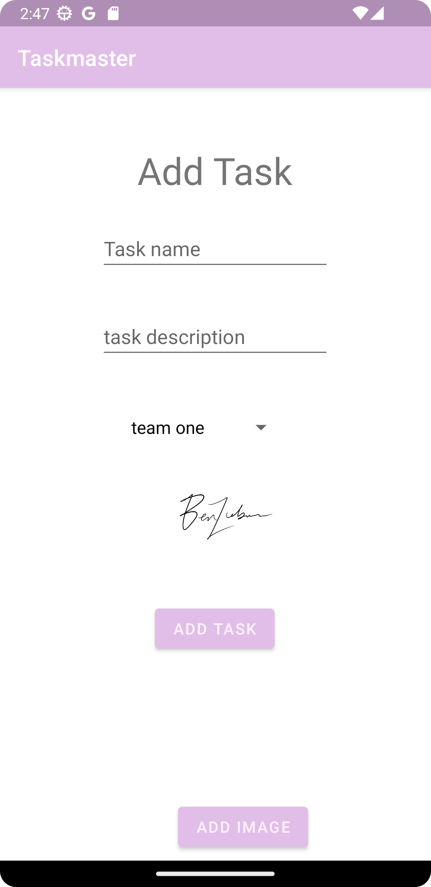

# TaskMaster Android App

This is a simple app for making a todo list.

See home page here: 

## Changelog

For lab 27, a settings and task detail page has been added. On the settings page, a user can now save their username.

Lab 28: `RecyclerView` implemented with instances `Task` as viewable items. 

Lab 29: Database access using the Room library for SQLite.

Lab 33: Amplify functionality now fully working. Tasks can be associated with teams. Views are separated into an Add Task, All Tasks, and Home view.

Lab 34-36: Amplify and Cognito configured to work with login.

Lab 37: Image uploads work; image view with tasks is a WIP.

Deployment:

I thought deploying the app to Google Play was pretty simple. I had to redo the AAB once because of a naming conflict but otherwise it was seamless. I simply built the AAB and uploaded it. Everything else went fine.
