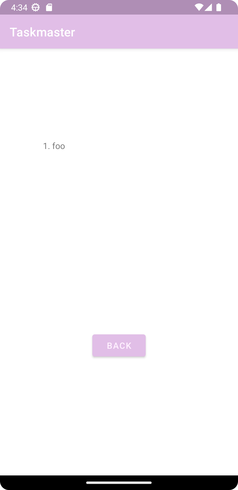

# TaskMaster Android App

This is a simple app for making a todo list.

See home page here: 

## Changelog

For lab 27, a settings and task detail page has been added. On the settings page, a user can now save their username.

Lab 28: `RecyclerView` implemented with instances `Task` as viewable items. 

Lab 29: Database access using the Room library for SQLite.

Lab 33: Amplify functionality now fully working. Tasks can be associated with teams. Views are separated into an Add Task, All Tasks, and Home view.
